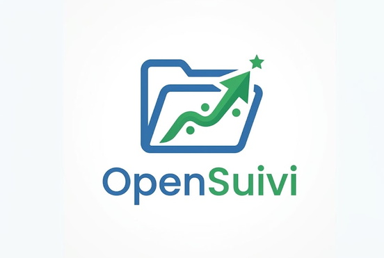

<p align="center">
  
</p>

<h1 align="center">OpenSuivi - Gestion de Classe Bac Pro</h1>

<p align="center">
  
  
  
</p>

**OpenSuivi** est un logiciel bureau gratuit et open source, conçu par un enseignant pour les enseignants. Il simplifie grandement le suivi individualisé, la gestion des stages (PFMP), et l'orientation des élèves, en particulier pour les classes de **Bac Pro**.

Ce projet a été initialement développé pour être partagé sur la **Forge des Communs Numériques de l'Éducation Nationale**.

---

### ✨ Nouveautés de la Version 1.1.0
- **Ouverture globale Bac Pro** : Le logiciel s'adresse désormais à l'ensemble des filières professionnelles (les labels spécifiques ont été rendus universels).
- **Gestion Avancée des PFMP** : 
  - Ajout du statut "Non fait" pour les stages annulés ou non réalisés.
  - Le tableau de bord a été réécrit pour compter intelligemment les *fiches de stages* (au lieu des élèves), permettant de gérer parfaitement les élèves ayant plusieurs périodes de stages dans l'année.
  - La liste détaillée des recherches de stage a été améliorée (affichage des périodes pour chaque élève et alerte pour les élèves n'ayant aucune fiche créée).
- **Confort d'utilisation** : Correction d'un bug système où les fenêtres de pop-up d'erreur ou de validation se cachaient derrière la fenêtre principale.

---

## 📥 Téléchargement (Pour les utilisateurs)

Pas besoin d'installer Python ou de savoir coder ! Vous pouvez télécharger directement l'application prête à l'emploi :

1. Allez dans l'onglet **[Releases](../../releases)** (ou **Actions**) sur le côté droit de cette page GitHub.
2. Téléchargez la version qui correspond à votre ordinateur :
   - Pour Windows : `OpenSuivi.exe`
   - Pour Linux : `OpenSuivi-x86_64.AppImage`
3. Double-cliquez, et c'est parti !

---

## ✨ Fonctionnalités Principales

- 📊 **Tableau de Bord Global** : Une vue d'ensemble en temps réel de votre classe.
- 🧑‍🎓 **Gestion des Élèves** : Fiches individuelles détaillées avec gestion des responsables légaux (coordonnées).
- 💼 **Suivi des PFMP (Stages)** : Interface claire pour savoir quels élèves ont trouvé un stage, lesquels cherchent encore, avec historique des dates et des entreprises.
- 🧭 **Suivi d'Orientation** : Recueil et statistiques sur les vœux des élèves (1ère CIEL, 1ère MELEC, ou autres filières personnalisées).
- 📝 **Journal de Suivi** : Un "carnet de bord" pour noter facilement le comportement, l'attitude au travail ou toute remarque diverse, de manière chronologique.
- 📄 **Export PDF** : 
  - Génération d'un rapport global de la classe en 1 clic.
  - Génération de bilans individuels pour chaque élève (idéal pour les conseils de classe ou les rencontres parents-professeurs).
- 🎨 **Personnalisation** : Mode Sombre / Clair / Système sauvegardé automatiquement.

## 🛠️ Prérequis

Pour lancer OpenSuivi sur votre machine, vous devez avoir **Python 3** installé.
Le logiciel utilise les bibliothèques suivantes :
- `customtkinter` (pour l'interface graphique moderne)
- `pillow` (pour la gestion des images)
- `fpdf2` (pour la génération des exports PDF)

## 🚀 Installation & Utilisation

1. **Cloner le dépôt**
   ```bash
   git clone https://github.com/Supoz9/OpenSuivi.git
   cd OpenSuivi
   ```

2. **Créer un environnement virtuel (recommandé)**
   ```bash
   python -m venv venv
   source venv/bin/activate  # Sur Linux/Mac
   venv\Scripts\activate     # Sur Windows
   ```

3. **Installer les dépendances**
   ```bash
   pip install customtkinter pillow fpdf2
   ```

4. **Lancer l'application**
   ```bash
   python main.py
   ```
   *Note : Au premier lancement, le logiciel créera automatiquement un dossier `data` contenant votre base de données SQLite (`openn_suivi.db`).*

## 📂 Structure du projet

```
OpenSuivi/
├── main.py            # Fichier principal (Interface Graphique & Logique)
├── database.py        # Gestion de la création des tables SQLite
├── assets/            # Dossier contenant les images (logo, favicon)
├── data/              # Créé automatiquement (contient la Base de données et la Config)
└── exports/           # Créé automatiquement (contient tous vos rapports PDF)
```

## 🤝 Contribution

Ce projet est pensé comme un outil collaboratif pour aider les enseignants. Si vous souhaitez l'améliorer, proposer de nouvelles fonctionnalités, ou corriger des bugs :
1. Forkez le projet
2. Créez votre branche (`git checkout -b feature/NouvelleFonctionnalite`)
3. Commitez vos changements (`git commit -m 'Ajout de NouvelleFonctionnalite'`)
4. Pushez vers la branche (`git push origin feature/NouvelleFonctionnalite`)
5. Ouvrez une Pull Request !

## 📜 Licence

Ce projet est sous licence **MIT**. Vous êtes libre de l'utiliser, le modifier et le distribuer. Voir le code pour plus de détails.

---
**Auteur** : Mennock Barthélémy (Supoz9) - Professeur de CIEL au Lycée Claude Chappe - Arnage.
